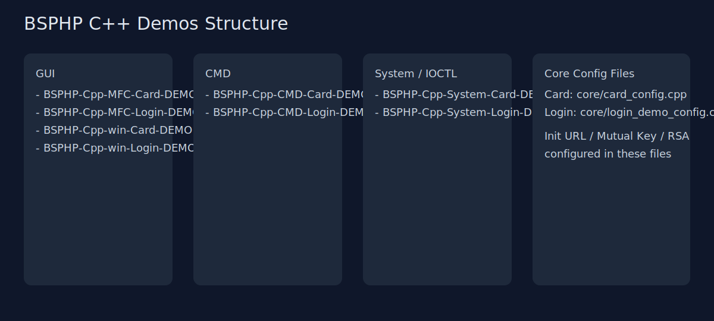

# BSPHP-Cpp-System-Login-DEMO

登录模式系统层调用演示，包含：

- 完整 BSPHP 登录请求链路（`login.lg` 等）
- 驱动层 IOCTL 调用命令（`ioctl_install` / `ioctl_login` / `ioctl_sms`）

## 配置初始化文件

- 地址与密钥初始化文件：`core/login_demo_config.cpp`
- 主要配置项：
  - `kBSPHPURL`
  - `kMutualKey`
  - `kServerKey` / `kClientKey`
  - `kCodeURLPrefix`

## 补充说明

- 驱动调用说明见：`驱动调用使用说明.md`（仓库根目录）

